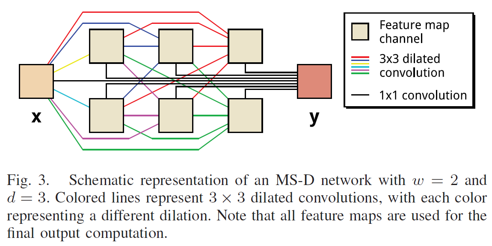
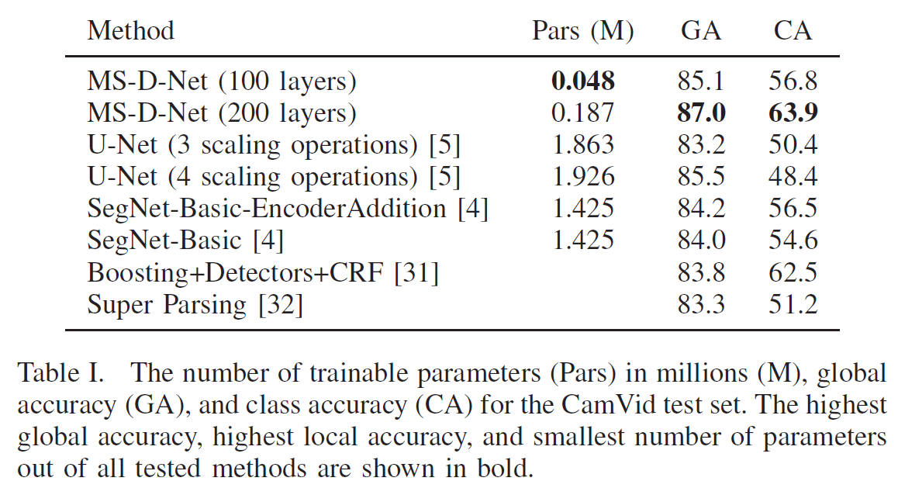

# A mixed-scale dense convolutional neural network for image analysis

This repository is a simplified implementation of the paper: A mixed-scale dense convolutional neural network for image analysis. The implementation uses the PyTorch framework. [详细见论文.](./MS-D.pdf)

## 网络结构

## 实验

